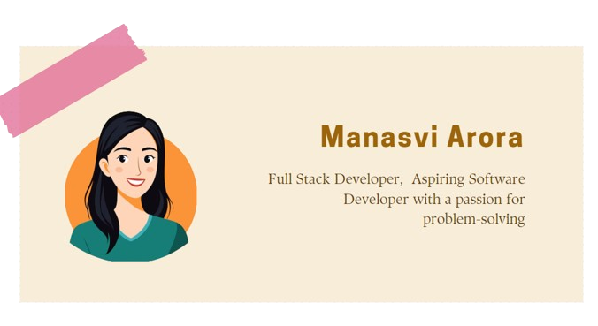

# Hi, I'm Manasvi 👋🏾 👩🏾‍💻

I am an aspiring software engineer with a passion for developing innovative technology solutions that elevate people and positively impact communities. I enjoy working with the MERN stack, applying my real-world problem-solving skills using Data Structures and Algorithms (DSA). I’m driven by the desire to contribute to the software industry by building scalable, user-centric applications.

## Find me around the web 🌎: 
🏓
-   C        Connect with me on <a>manasviarora28@gmail.com</a>
-   S        Sharing updates on <a href="https://www.linkedin.com/in/manasvi-arora-a76a0827a/">LinkedIn</a> 💼

### 

## Statistics

  
Click to expand

  <table>
    <tr>
      <td>
        
      </td>
      <td>
        
      </td>
    </tr>
  </table>

## Languages and Tools

  
Click to expand

  

    
    
    
    
    
    
    
    
    
    
    
    
    
    
    
    
    
    
    
    
    
    
    
    
    
    
    
    
    
    
    
  

 
  Visitor count 
  

